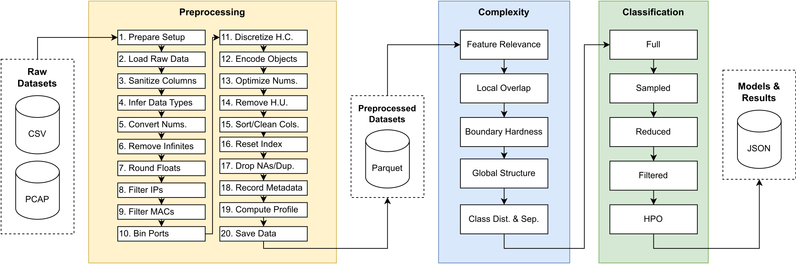

# Large-Scale Benchmarking of Intrusion Detection Datasets with GPU-Accelerated Data Pipelines, Complexity Analysis, and Model Evaluation
  
Authors: *Marcelo V. C. Aragão, Felipe A. P. de Figueiredo, and Samuel B. Mafra*



## Abstract
    Intrusion Detection Systems (IDSs) are critical for identifying malicious activity
    in computer networks; however, the evaluation of machine learning-based IDSs
    remains inconsistent and fragmented. Many existing studies rely on outdated or
    synthetic datasets, neglect computational complexity, or use limited performance
    metrics, making comparison and reproducibility difficult. Moreover, few works
    leverage the full potential of modern GPU acceleration across all stages of IDS
    pipelines.
        This paper presents a large-scale, GPU-accelerated benchmarking framework for
    intrusion detection, integrating automated data preprocessing, dataset complexity
    analysis, and classification evaluation. The pipeline supports entropy-guided
    encoding, multi-objective hyperparameter optimization, and reproducible assessment
    across more than 70 publicly available IDS datasets.
        Our findings show that data- and model-efficient configurations can match the
    predictive performance of full-scale models while significantly reducing training
    time, inference latency, and model size. In some cases, setups even improve
    generalization by removing noise or redundant features. These insights are
    supported by distributional and correlation-based analyses, offering a nuanced
    view of performance-efficiency trade-offs in IDS evaluation.
        All code, configurations, and results are released to support reproducible
    research. This work aims to facilitate future benchmarking efforts and inform the
    design of efficient, generalizable IDS models.

## Environment
- Host OS: Windows 11 Pro 23H2
- Guest OS: Ubuntu 22.04.5 LTS
- WSL: 6.6.87.1-microsoft-standard-WSL2
- System: AMD Ryzen 9 5900X CPU, 128 GB DDR4-3200 RAM
- GPU: Nvidia GeForce RTX 4090 (24 GB, driver version 576.80, CUDA version 12.9)

## Setup
```bash
sudo apt install git-lfs libnss3 libatk-bridge2.0-0 libcups2 libxcomposite1 libxdamage1 libxfixes3 libxrandr2 libgbm1 libxkbcommon0 libpango-1.0-0 libcairo2 libasound2

git lfs install

git clone https://github.com/marcelovca90/ids-ml-gpu-benchmark.git

cd ids-ml-gpu-benchmark

git lfs pull

conda create -n rapids-25.04 -c rapidsai -c conda-forge -c nvidia rapids=25.04 python=3.12 'cuda-version>=12.0,<=12.8' jupyterlab

conda activate rapids-25.04

pip install -r requirements.txt
```

## Execution
1. Download original dataset files (please refer to the bibliography in the manuscript)
```tex
Table 2: Summary of all preprocessed datasets and their structural properties.
```
2. Preprocess datasets
```bash
PYTHONPATH=. python -u main.py ; \
PYTHONPATH=. python -u modules/preprocessing/custom/bccc.py ; \
PYTHONPATH=. python -u modules/preprocessing/custom/CICAPT_IIoT.py ; \
PYTHONPATH=. python -u modules/preprocessing/custom/CICEVSE2024.py ; \
PYTHONPATH=. python -u modules/preprocessing/custom/CICIoV2024.py ; \
PYTHONPATH=. python -u modules/preprocessing/custom/edge_iiotset.py ; \
PYTHONPATH=. python -u modules/preprocessing/custom/n_baiot.py ; \
PYTHONPATH=. python -u modules/preprocessing/custom/nids.py ; \
PYTHONPATH=. python -u modules/preprocessing/custom/ton_iot.py ; \
PYTHONPATH=. python -u move_files.py
```
3. Calculate complexity metrics
```bash
PYTHONPATH=. python -u modules/complexity/preparer.py ; \
PYTHONPATH=. python -u modules/complexity/calculator.py ; \
PYTHONPATH=. python -u modules/complexity/parser.py
```
4. Run the evaluation pipeline
```bash
jupyter lab modules/evaluation/evaluator_runner.ipynb
jupyter lab modules/evaluation/refitter_runner.ipynb
```
5. Run the evaluation parser
```bash
jupyter lab modules/evaluation/evaluator_parser.ipynb
```
